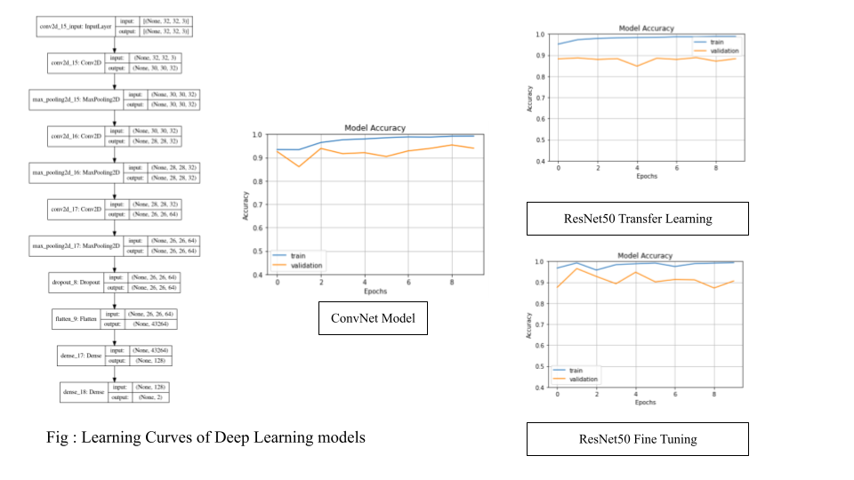

# Driver Drowsiness Detection System for Road Safety

## Install requirements
```{r, engine='bash', count_lines}
pip install -r requirements.txt
```

## How to start demo 
```{r, engine='bash', count_lines}
python drowsiness detection.py
```


## Dataset  
This dataset is just one part of The MRL Eye Dataset, the large-scale dataset of human eye images. It is prepared for classification tasks This dataset contains infrared images in low and high resolution, all captured in various lighting conditions and by different devices. The dataset is suitable for testing several features or trainable classifiers. In order to simplify the comparison of algorithms, the images are divided into several categories, which also makes them suitable for training and testing classifiers.

The full dataset is available here : http://mrl.cs.vsb.cz/eyedataset

Our dataset includes **24K** images for both closed and open eye categories.

- Training images : 38400
- Validation images : 9600

- Orginal size (86,86,3)
- Resized (32,32,3) -> smaller image size means less training time !

Dataset has been already balanced,i.e both categories have same num of images. Thus, we shall only look at Accuracy metric.

Key metric to consider model performance -> val_categorical_accuracy

## How to train

```{r, engine='bash', count_lines}
python train_cnn.py
```

## Training



- ResNet50 Transfer learning ( Baseline ) : 87.68%
- ResNet50 Transfer learning + Regularization : 87.78%
- ResNet50 Fine Tuning : 90.62%
- Our Custom ConvNEt : 94.7%

Although fine-tuned ResNet50 improved validation accuracy on our dataset, our custom ConvNet still stands as the best performance model.


## ResNet50 Transfer learning

Transfer learning means to apply the knowledge that some machine learning model holds (represented by its learned parameters) to a new (but in some way related) task.

```{r, engine='bash', count_lines}
Model: "sequential_1"
_________________________________________________________________
Layer (type)                 Output Shape              Param #   
=================================================================
resnet50 (Functional)        (None, 2048)              23587712  
_________________________________________________________________
flatten_1 (Flatten)          (None, 2048)              0         
_________________________________________________________________
dense_2 (Dense)              (None, 128)               262272    
_________________________________________________________________
dense_3 (Dense)              (None, 2)                 258       
=================================================================
Total params: 23,850,242
Trainable params: 262,530
Non-trainable params: 23,587,712

Epoch 1/10
1200/1200 [==============================] - 132s 107ms/step - loss: 0.1513 - categorical_accuracy: 0.9501 - precision_1: 0.9501 - recall_1: 0.9501 - val_loss: 0.2879 - val_categorical_accuracy: 0.8997 - val_precision_1: 0.8997 - val_recall_1: 0.8997
Epoch 2/10
1200/1200 [==============================] - 87s 72ms/step - loss: 0.0384 - categorical_accuracy: 0.9875 - precision_1: 0.9875 - recall_1: 0.9875 - val_loss: 0.3483 - val_categorical_accuracy: 0.8858 - val_precision_1: 0.8858 - val_recall_1: 0.8858
Epoch 3/10
1200/1200 [==============================] - 85s 71ms/step - loss: 0.0271 - categorical_accuracy: 0.9905 - precision_1: 0.9905 - recall_1: 0.9905 - val_loss: 0.4922 - val_categorical_accuracy: 0.8753 - val_precision_1: 0.8753 - val_recall_1: 0.8753
Epoch 4/10
1200/1200 [==============================] - 86s 72ms/step - loss: 0.0235 - categorical_accuracy: 0.9924 - precision_1: 0.9924 - recall_1: 0.9924 - val_loss: 0.6105 - val_categorical_accuracy: 0.8680 - val_precision_1: 0.8680 - val_recall_1: 0.8680
Epoch 5/10
1200/1200 [==============================] - 85s 71ms/step - loss: 0.0199 - categorical_accuracy: 0.9927 - precision_1: 0.9927 - recall_1: 0.9927 - val_loss: 0.6666 - val_categorical_accuracy: 0.8661 - val_precision_1: 0.8661 - val_recall_1: 0.8661
Epoch 6/10
1200/1200 [==============================] - 85s 71ms/step - loss: 0.0132 - categorical_accuracy: 0.9957 - precision_1: 0.9957 - recall_1: 0.9957 - val_loss: 0.6288 - val_categorical_accuracy: 0.8597 - val_precision_1: 0.8597 - val_recall_1: 0.8597
Epoch 7/10
1200/1200 [==============================] - 87s 72ms/step - loss: 0.0173 - categorical_accuracy: 0.9942 - precision_1: 0.9942 - recall_1: 0.9942 - val_loss: 0.7032 - val_categorical_accuracy: 0.8772 - val_precision_1: 0.8772 - val_recall_1: 0.8772
Epoch 8/10
1200/1200 [==============================] - 84s 70ms/step - loss: 0.0106 - categorical_accuracy: 0.9960 - precision_1: 0.9960 - recall_1: 0.9960 - val_loss: 0.8443 - val_categorical_accuracy: 0.8546 - val_precision_1: 0.8546 - val_recall_1: 0.8546
Epoch 9/10
1200/1200 [==============================] - 85s 71ms/step - loss: 0.0111 - categorical_accuracy: 0.9966 - precision_1: 0.9966 - recall_1: 0.9966 - val_loss: 0.8650 - val_categorical_accuracy: 0.8710 - val_precision_1: 0.8710 - val_recall_1: 0.8710
Epoch 10/10
1200/1200 [==============================] - 84s 70ms/step - loss: 0.0131 - categorical_accuracy: 0.9957 - precision_1: 0.9957 - recall_1: 0.9957 - val_loss: 0.6495 - val_categorical_accuracy: 0.8768 - val_precision_1: 0.8768 - val_recall_1: 0.8768
```

## ResNet50 Transfer learning + Regularization

- Regularization was added because transfer learning model seems to be overfit.
- Overfit happens when the model learnt only "training data" by heart.
- To fix it we have following options
	1. Reduce network complexity
	2. Use drop out ( more dropout in last layers)
	3. Regularise
	4. Use batch norms
	5. Increase the tranning dataset size.
	
For our case, I added a dropout layer with the rate 0.5 ( 50% of learning weights will be cut off randomly ! )

```
Epoch 1/10
1200/1200 [==============================] - 90s 72ms/step - loss: 0.2358 - categorical_accuracy: 0.9287 - precision_2: 0.9287 - recall_2: 0.9287 - val_loss: 0.2867 - val_categorical_accuracy: 0.9003 - val_precision_2: 0.9003 - val_recall_2: 0.9003
Epoch 2/10
1200/1200 [==============================] - 84s 70ms/step - loss: 0.0695 - categorical_accuracy: 0.9756 - precision_2: 0.9756 - recall_2: 0.9756 - val_loss: 0.3544 - val_categorical_accuracy: 0.8972 - val_precision_2: 0.8972 - val_recall_2: 0.8972
Epoch 3/10
1200/1200 [==============================] - 84s 70ms/step - loss: 0.0588 - categorical_accuracy: 0.9786 - precision_2: 0.9786 - recall_2: 0.9786 - val_loss: 0.5273 - val_categorical_accuracy: 0.8509 - val_precision_2: 0.8509 - val_recall_2: 0.8509
Epoch 4/10
1200/1200 [==============================] - 85s 71ms/step - loss: 0.0506 - categorical_accuracy: 0.9817 - precision_2: 0.9817 - recall_2: 0.9817 - val_loss: 0.4041 - val_categorical_accuracy: 0.8765 - val_precision_2: 0.8765 - val_recall_2: 0.8765
Epoch 5/10
1200/1200 [==============================] - 84s 70ms/step - loss: 0.0462 - categorical_accuracy: 0.9821 - precision_2: 0.9821 - recall_2: 0.9821 - val_loss: 0.4800 - val_categorical_accuracy: 0.8665 - val_precision_2: 0.8665 - val_recall_2: 0.8665
Epoch 6/10
1200/1200 [==============================] - 70s 59ms/step - loss: 0.0408 - categorical_accuracy: 0.9851 - precision_2: 0.9851 - recall_2: 0.9851 - val_loss: 0.4900 - val_categorical_accuracy: 0.8776 - val_precision_2: 0.8776 - val_recall_2: 0.8776
Epoch 7/10
1200/1200 [==============================] - 70s 59ms/step - loss: 0.0376 - categorical_accuracy: 0.9866 - precision_2: 0.9866 - recall_2: 0.9866 - val_loss: 0.4802 - val_categorical_accuracy: 0.8833 - val_precision_2: 0.8833 - val_recall_2: 0.8833
Epoch 8/10
1200/1200 [==============================] - 70s 58ms/step - loss: 0.0345 - categorical_accuracy: 0.9877 - precision_2: 0.9877 - recall_2: 0.9877 - val_loss: 0.4941 - val_categorical_accuracy: 0.8838 - val_precision_2: 0.8838 - val_recall_2: 0.8838
Epoch 9/10
1200/1200 [==============================] - 70s 59ms/step - loss: 0.0350 - categorical_accuracy: 0.9879 - precision_2: 0.9879 - recall_2: 0.9879 - val_loss: 0.5665 - val_categorical_accuracy: 0.8778 - val_precision_2: 0.8778 - val_recall_2: 0.8778
Epoch 10/10
1200/1200 [==============================] - 82s 68ms/step - loss: 0.0310 - categorical_accuracy: 0.9894 - precision_2: 0.9894 - recall_2: 0.9894 - val_loss: 0.6104 - val_categorical_accuracy: 0.8778 - val_precision_2: 0.8778 - val_recall_2: 0.8778
```

## ResNet50 Fine Tuning

**Try Fine-tuning when your transfer learning model is still needed to improve**

Fine-tuning means taking some machine learning model that has already learned something before (i.e. been trained on some data) and then training that model (i.e. training it some more, possibly on different data). 

```
Epoch 1/10
1200/1200 [==============================] - 95s 74ms/step - loss: 0.2215 - categorical_accuracy: 0.9311 - precision_4: 0.9311 - recall_4: 0.9311 - val_loss: 0.5102 - val_categorical_accuracy: 0.8756 - val_precision_4: 0.8756 - val_recall_4: 0.8756
Epoch 2/10
1200/1200 [==============================] - 87s 72ms/step - loss: 0.0243 - categorical_accuracy: 0.9932 - precision_4: 0.9932 - recall_4: 0.9932 - val_loss: 0.1330 - val_categorical_accuracy: 0.9654 - val_precision_4: 0.9654 - val_recall_4: 0.9654
Epoch 3/10
1200/1200 [==============================] - 86s 71ms/step - loss: 0.0727 - categorical_accuracy: 0.9774 - precision_4: 0.9774 - recall_4: 0.9774 - val_loss: 0.2217 - val_categorical_accuracy: 0.9277 - val_precision_4: 0.9277 - val_recall_4: 0.9277
Epoch 4/10
1200/1200 [==============================] - 86s 72ms/step - loss: 0.0592 - categorical_accuracy: 0.9814 - precision_4: 0.9814 - recall_4: 0.9814 - val_loss: 0.3647 - val_categorical_accuracy: 0.8930 - val_precision_4: 0.8930 - val_recall_4: 0.8930
Epoch 5/10
1200/1200 [==============================] - 86s 71ms/step - loss: 0.0381 - categorical_accuracy: 0.9886 - precision_4: 0.9886 - recall_4: 0.9886 - val_loss: 0.1688 - val_categorical_accuracy: 0.9480 - val_precision_4: 0.9480 - val_recall_4: 0.9480
Epoch 6/10
1200/1200 [==============================] - 86s 71ms/step - loss: 0.0289 - categorical_accuracy: 0.9920 - precision_4: 0.9920 - recall_4: 0.9920 - val_loss: 0.2743 - val_categorical_accuracy: 0.9021 - val_precision_4: 0.9021 - val_recall_4: 0.9021
Epoch 7/10
1200/1200 [==============================] - 85s 71ms/step - loss: 0.1297 - categorical_accuracy: 0.9605 - precision_4: 0.9605 - recall_4: 0.9605 - val_loss: 0.2640 - val_categorical_accuracy: 0.9134 - val_precision_4: 0.9134 - val_recall_4: 0.9134
Epoch 8/10
1200/1200 [==============================] - 85s 71ms/step - loss: 0.0423 - categorical_accuracy: 0.9882 - precision_4: 0.9882 - recall_4: 0.9882 - val_loss: 0.2241 - val_categorical_accuracy: 0.9117 - val_precision_4: 0.9117 - val_recall_4: 0.9117
Epoch 9/10
1200/1200 [==============================] - 87s 72ms/step - loss: 0.0268 - categorical_accuracy: 0.9918 - precision_4: 0.9918 - recall_4: 0.9918 - val_loss: 0.3247 - val_categorical_accuracy: 0.8728 - val_precision_4: 0.8728 - val_recall_4: 0.8728
Epoch 10/10
1200/1200 [==============================] - 89s 74ms/step - loss: 0.0217 - categorical_accuracy: 0.9926 - precision_4: 0.9926 - recall_4: 0.9926 - val_loss: 0.3339 - val_categorical_accuracy: 0.9062 - val_precision_4: 0.9062 - val_recall_4: 0.9062
```

## CNN model

```
Model: "sequential"
_________________________________________________________________
Layer (type)                 Output Shape              Param #   
=================================================================
conv2d (Conv2D)              (None, 30, 30, 32)        896       
_________________________________________________________________
max_pooling2d (MaxPooling2D) (None, 30, 30, 32)        0         
_________________________________________________________________
conv2d_1 (Conv2D)            (None, 28, 28, 32)        9248      
_________________________________________________________________
max_pooling2d_1 (MaxPooling2 (None, 28, 28, 32)        0         
_________________________________________________________________
conv2d_2 (Conv2D)            (None, 26, 26, 64)        18496     
_________________________________________________________________
max_pooling2d_2 (MaxPooling2 (None, 26, 26, 64)        0         
_________________________________________________________________
dropout (Dropout)            (None, 26, 26, 64)        0         
_________________________________________________________________
flatten (Flatten)            (None, 43264)             0         
_________________________________________________________________
dense (Dense)                (None, 128)               5537920   
_________________________________________________________________
dense_1 (Dense)              (None, 2)                 258       
=================================================================
Total params: 5,566,818
Trainable params: 5,566,818
Non-trainable params: 0

Epoch 1/10
1200/1200 [==============================] - 356s 291ms/step - loss: 3.9119 - categorical_accuracy: 0.9022 - precision: 0.9022 - recall: 0.9022 - val_loss: 0.1849 - val_categorical_accuracy: 0.9310 - val_precision: 0.9310 - val_recall: 0.9310
Epoch 2/10
1200/1200 [==============================] - 75s 63ms/step - loss: 0.0709 - categorical_accuracy: 0.9771 - precision: 0.9771 - recall: 0.9771 - val_loss: 0.2785 - val_categorical_accuracy: 0.9085 - val_precision: 0.9085 - val_recall: 0.9085
Epoch 3/10
1200/1200 [==============================] - 74s 62ms/step - loss: 0.0573 - categorical_accuracy: 0.9819 - precision: 0.9819 - recall: 0.9819 - val_loss: 0.1398 - val_categorical_accuracy: 0.9541 - val_precision: 0.9541 - val_recall: 0.9541
Epoch 4/10
1200/1200 [==============================] - 74s 62ms/step - loss: 0.0434 - categorical_accuracy: 0.9864 - precision: 0.9864 - recall: 0.9864 - val_loss: 0.2013 - val_categorical_accuracy: 0.9389 - val_precision: 0.9389 - val_recall: 0.9389
Epoch 5/10
1200/1200 [==============================] - 73s 61ms/step - loss: 0.0342 - categorical_accuracy: 0.9886 - precision: 0.9886 - recall: 0.9886 - val_loss: 0.2002 - val_categorical_accuracy: 0.9379 - val_precision: 0.9379 - val_recall: 0.9379
Epoch 6/10
1200/1200 [==============================] - 82s 69ms/step - loss: 0.0389 - categorical_accuracy: 0.9882 - precision: 0.9882 - recall: 0.9882 - val_loss: 0.1225 - val_categorical_accuracy: 0.9616 - val_precision: 0.9616 - val_recall: 0.9616
Epoch 7/10
1200/1200 [==============================] - 76s 63ms/step - loss: 0.0250 - categorical_accuracy: 0.9923 - precision: 0.9923 - recall: 0.9923 - val_loss: 0.2615 - val_categorical_accuracy: 0.9149 - val_precision: 0.9149 - val_recall: 0.9149
Epoch 8/10
1200/1200 [==============================] - 96s 80ms/step - loss: 0.0255 - categorical_accuracy: 0.9922 - precision: 0.9922 - recall: 0.9922 - val_loss: 0.2217 - val_categorical_accuracy: 0.9355 - val_precision: 0.9355 - val_recall: 0.9355
Epoch 9/10
1200/1200 [==============================] - 87s 72ms/step - loss: 0.0204 - categorical_accuracy: 0.9936 - precision: 0.9936 - recall: 0.9936 - val_loss: 0.2762 - val_categorical_accuracy: 0.9329 - val_precision: 0.9329 - val_recall: 0.9329
Epoch 10/10
1200/1200 [==============================] - 78s 65ms/step - loss: 0.0171 - categorical_accuracy: 0.9947 - precision: 0.9947 - recall: 0.9947 - val_loss: 0.1950 - val_categorical_accuracy: 0.9470 - val_precision: 0.9470 - val_recall: 0.9470
```
